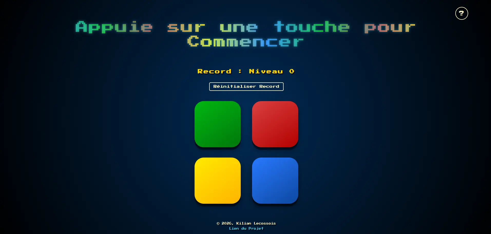

# 🎮 Simon-game

Un jeu Simon classique, simple à prendre en main mais redoutable à maîtriser.
Inspiré du célèbre jeu électronique des années 80.
Réalisé en HTML, CSS et JavaScript.

## 🕹️ Démo en ligne :

👉 [Jouer au Simon Game](https://kilecos.github.io/Simon-game/)

## ✨ Fonctionnaltés :

- Séquences de couleurs progressives et aléatoires
- Sons distincts pour chaque couleur et erreur
- Sauvegarge automatique du meilleur score
- Détection de nouveau record et mise à jour de la sauvegarde
- Possibilité de réinitialisation du record sauvegardé
- Adapté sur mobile (écran tactile)
- Fenêtre contenant les règles du jeu intégrée

## 🛠️ Techonologies :

- HTML5 / CSS3
- JavaScript / jQuery
- Howler.js (gestion audio cross-platform)

## 🚀 Lancer en local :

1. Cloner le dépôt
2. Ouvrir dans VS Code
3. Lancer avec **Live Server**

